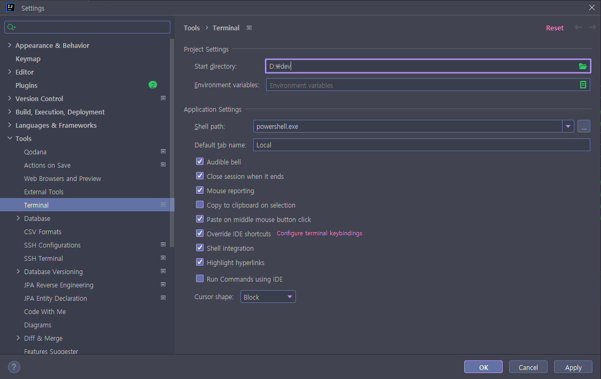
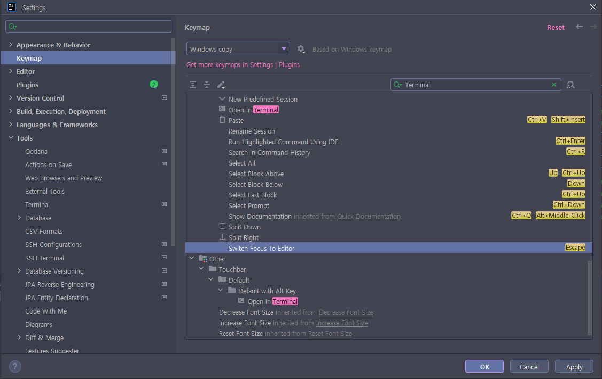
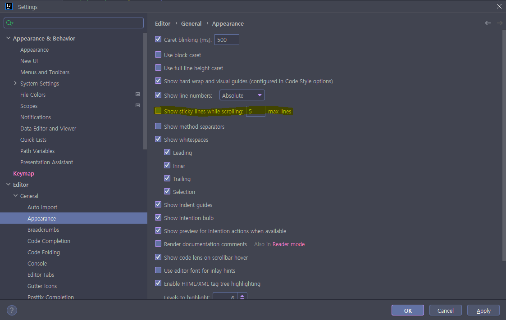
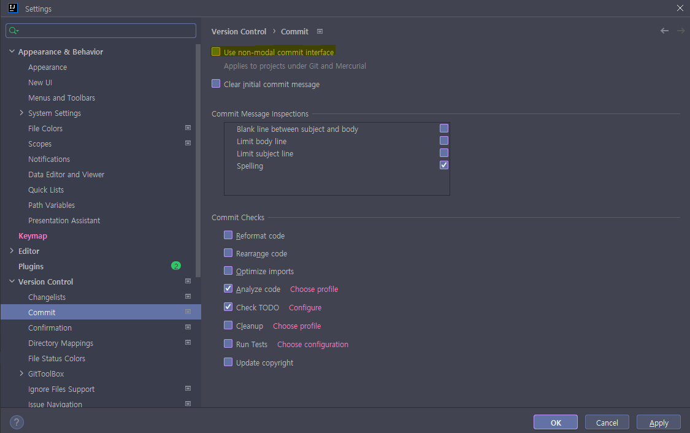

# 1.JetBrains Terminal에서 vi 명령 모드(escape) 이동이 안되는 경우
  
  > Configure Terminal Keybindings 링크 클릭

  
  > Keymap 항목 Switch Forcust To Editor 해제 또는 변경

# 2. Terminal 변경
  ## 2.1 Git bash
  > "D:\git\bin\sh.exe" -login -i
  ## 2.2 WSL
  > C:\Users\${사용자}\AppData\Local\Microsoft\WindowsApps\CanonicalGroupLimited.Ubuntu22.04LTS_79rhkp1fndgsc\ubuntu2204.exe

# 3. Local 환경 주기
- IntelliJ
  Run Configrations > Configration > Active Profiles > local 입력 후 apply

# 4.인텔리제이 에디터 상위 돋보기 해제
  
  > Show sticky lines while scolling 항목 체크박스 해제
 
# 5. Git 항목 Local Changes 안보이는 경우
  
  > Use non-modal commit interface 항목 체크박스 해제